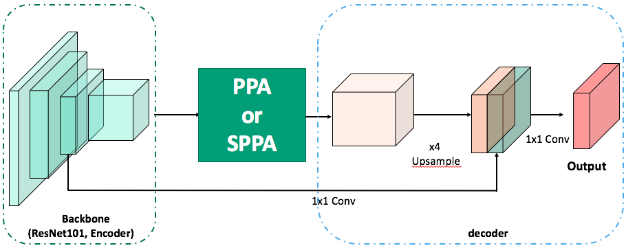
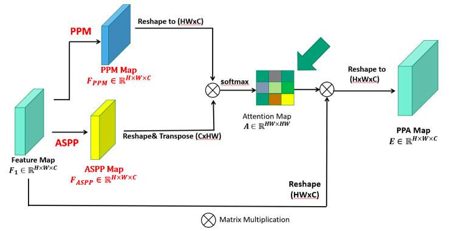
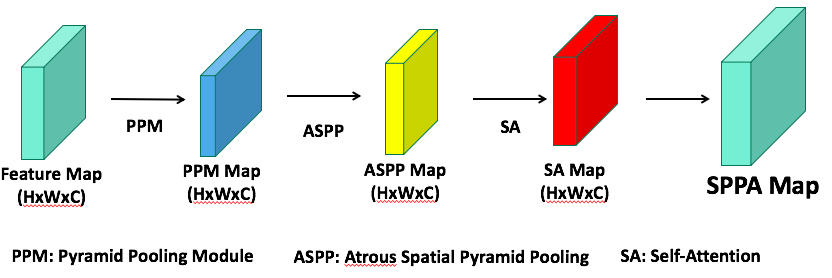

# PP-Attention Net: Pyramid Pooling Attention Network.

## Network Architecture

**whole network** 
This is the whole network architecture.
 

**Pyramid Pooling Attention Module(PPA Module)** 
We propose the new module that is called 'Pyramid Pooling Attention (PPA)'.
PPA module include Pyramid Pooling module(PPM) which is proposed in [PSPNet](https://arxiv.org/abs/1612.01105), Atrous Spatial Pyramid Pooling module(ASPP) which is proposed in [Deeplab](https://arxiv.org/abs/1606.00915) and Self-Attention module proposed in [SAGAN](https://arxiv.org/abs/1805.08318).
 

 **Straight Pyramid Pooling Attention Module(SPPA Module)** 

## References
1. **tensorflow-DeepLab**  
 [link](https://github.com/tensorflow/models/tree/master/research/deeplab)
